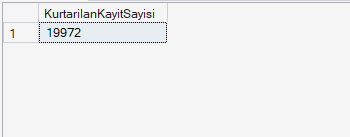

# Proje 2: Veritabanı Yedekleme ve Felaketten Kurtarma
## 1. Veritabanı Kurulumu ve İlk Hazırlıklar

# Tam Yedek Alındı

## 2. Fark Yedeği (Differential Backup) ve Felaket Senaryosu
Sabah alınan tam yedeğin üzerine, öğlen saatlerinde bir fark yedeği alınmıştır. Ardından kaza ile silinen verilerin simülasyonu için `Person.EmailAddress` tablosundan e-posta adresi 'a' ile başlayan yüzlerce kritik iletişim verisi yanlışlıkla silinmiştir. Veritabanının bütünlüğünü koruyan Foreign Key kısıtlamaları da bu süreçte test edilmiştir.

## 3. Kurtarma (Restore) İşlemi ve Recovery Model Analizi
Kurtarma işleminden önce Tail-Log (Kuyruk Log) yedeği alınmak istenmiş, ancak AdventureWorks veritabanının varsayılan olarak **SIMPLE Recovery Model**'de çalışması nedeniyle SQL Server log yedeği alınmasına izin vermemiştir. 
Bu durum analiz edilerek strateji güncellenmiş; veriler silinmeden hemen önce alınan "Fark Yedeği (Differential Backup)" kullanılarak Point-in-Time öncesi duruma başarılı bir şekilde dönülmüştür.

Sırasıyla FULL yedek (NORECOVERY) ve ardından DIFFERENTIAL yedek (RECOVERY) uygulanarak silinen binlerce e-posta adresi eksiksiz olarak geri getirilmiştir.

