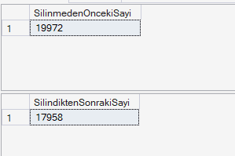

# Proje 2: Veritabanı Yedekleme ve Felaketten Kurtarma
## 1. Veritabanı Kurulumu ve İlk Hazırlıklar

# Tam Yedek Alındı

## 2. Fark Yedeği (Differential Backup) ve Felaket Senaryosu
Sabah alınan tam yedeğin üzerine, öğlen saatlerinde bir fark yedeği alınmıştır. Ardından kaza ile silinen verilerin simülasyonu için `Person.EmailAddress` tablosundan e-posta adresi 'a' ile başlayan yüzlerce kritik iletişim verisi yanlışlıkla silinmiştir. Veritabanının bütünlüğünü koruyan Foreign Key kısıtlamaları da bu süreçte test edilmiştir.

