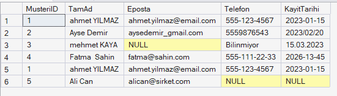

# Proje 5: Veri Temizleme ve ETL Süreçleri
## 1. Veri Seti İncelemesi

# Proje 5: Veri Temizleme ve ETL Süreçleri Tasarımı

## 1. Veri Setinin İncelenmesi (Extract)
ETL sürecinin ilk aşaması olarak, dış sistemlerden geldiği varsayılan tutarsız ve hatalı verileri barındıran bir `Musteri_Staging` (Geçici) tablosu oluşturulmuştur. 

Veri setindeki başlıca anomaliler şunlardır:
* **Tutarsız Metin Formatları:** İsimlerde büyük/küçük harf uyumsuzluğu ve gereksiz boşluklar.
* **Geçersiz E-posta Adresleri:** `@` işareti içermeyen veya eksik olan e-posta kayıtları.
* **Tip Uyuşmazlıkları:** Telefon numarası alanında metin ("Bilinmiyor") yer alması.
* **Standart Dışı Tarihler:** Farklı ayraçlar (`/`, `.`, `-`) kullanılan ve takvimde var olmayan (örn: 13. ay) tarihler.
* **Kopya (Duplicate) Kayıtlar:** Birebir aynı veriye sahip mükerrer satırlar.
* **Eksik (NULL) Veriler.**

