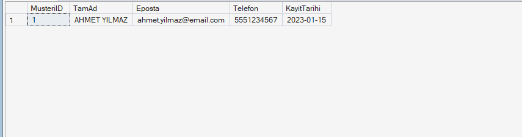

# Proje 5: Veri Temizleme ve ETL Süreçleri Tasarımı

## 1. Veri Setinin İncelenmesi (Extract)
ETL sürecinin ilk aşaması olarak, dış sistemlerden geldiği varsayılan tutarsız ve hatalı verileri barındıran bir `Musteri_Staging` (Geçici) tablosu oluşturulmuştur. 

Veri setindeki başlıca anomaliler şunlardır:
* **Tutarsız Metin Formatları:** İsimlerde büyük/küçük harf uyumsuzluğu ve gereksiz boşluklar.
* **Geçersiz E-posta Adresleri:** `@` işareti içermeyen veya eksik olan e-posta kayıtları.
* **Tip Uyuşmazlıkları:** Telefon numarası alanında metin ("Bilinmiyor") yer alması.
* **Standart Dışı Tarihler:** Farklı ayraçlar (`/`, `.`, `-`) kullanılan ve takvimde var olmayan (örn: 13. ay) tarihler.
* **Kopya (Duplicate) Kayıtlar:** Birebir aynı veriye sahip mükerrer satırlar.
* **Eksik (NULL) Veriler.**

## 2. Transform (Dönüştürme) ve Load (Yükleme) Süreci
Geçici tablodaki kirli veriler, T-SQL fonksiyonları (CTE, TRY_CONVERT, ROW_NUMBER, UPPER/LOWER vb.) kullanılarak analiz edilmiş ve standartlaştırılmıştır. Bu aşamada uygulanan dönüşümler şunlardır:

* **Veri Tipi ve Format Dönüşümü:** Tarihlerdeki farklı ayraçlar standardize edilmiş ve `TRY_CONVERT` fonksiyonu ile güvenli bir şekilde `DATE` formatına dönüştürülmüştür. Mantıksız tarihler (13. ay) elimine edilmiştir.
* **Metin Standartlaştırma:** İsimlerdeki çift boşluklar `REPLACE` ile tek boşluğa düşürülmüş, tüm isimler büyük harfe, e-postalar küçük harfe çevrilmiştir. Telefon numaralarındaki tireler kaldırılarak sadece rakamsal format elde edilmiştir.
* **Kalite ve Tutarlılık Kontrolü:** Geçerli bir `@` ve `.` işareti barındırmayan e-postalar reddedilmiştir.
* **Tekilleştirme (Deduplication):** `ROW_NUMBER() OVER(PARTITION BY...)` mimarisi kullanılarak mükerrer (duplicate) kayıtlar tespit edilmiş ve veritabanına sadece tekil kayıtların (SiraNo = 1) girmesi sağlanmıştır.

Temizlenen, doğrulanan ve tekilleştirilen bu veriler başarılı bir şekilde asıl `Musteri_Hedef` tablosuna aktarılmıştır (Load).

